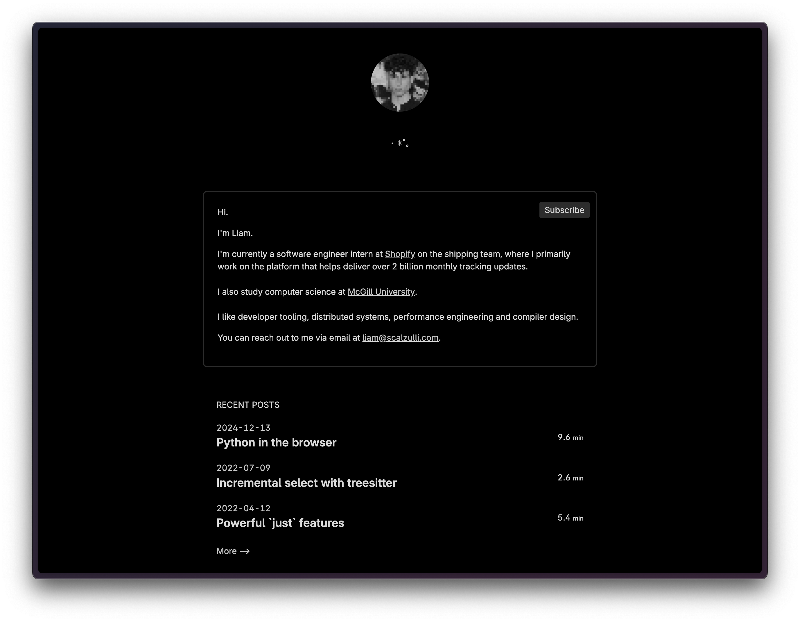

## liam.rs

[](https://github.com/terror/liam.rs/actions/workflows/ci.yaml)

Source code for my personal website built with bash and
[esh](https://github.com/jirutka/esh).



## Development

If you notice any typos feel free to submit a PR. All site content is in the
/posts directory.

Fork this repository and clone your fork:

```bash
git clone https://github.com/{username}/liam.rs.git
```

Make changes and generate static assets:

```bash
./bin/last-modified
./bin/generate-index
./bin/generate-projects.py
```

**n.b.** This requires you to have [uv](https://github.com/astral-sh/uv)
installed on your system.
