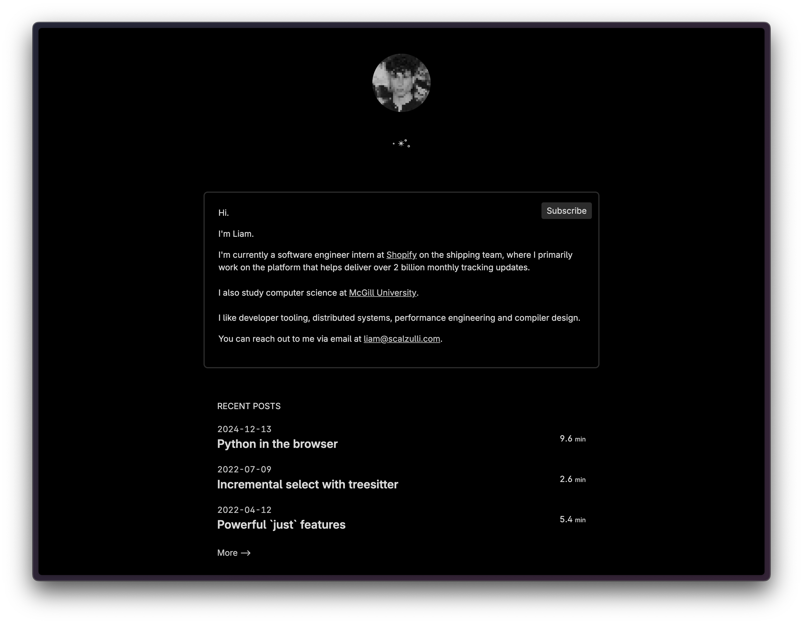

## liam.rs

[](https://github.com/terror/liam.rs/actions/workflows/ci.yaml)

`liam.rs` is the source for my personal website and static site generator.

The generator is written in Rust and uses [MiniJinja](https://github.com/mitsuhiko/minijinja)
for templates, [Pandoc](https://pandoc.org/) for Markdown rendering, and
[Axum](https://github.com/tokio-rs/axum) for the local development server.



The site generator handles:

- Rendering posts and projects from Markdown into static HTML.

- Loading typed YAML frontmatter for posts and projects.

- Generating the index, post archive, project archive, individual post pages,
  and RSS feed.

- Serving `docs/` locally with automatic browser refresh on file changes.

If you notice a typo, broken link, or rendering issue, feel free to open an
issue or submit a pull request.

## Development

Posts live in `posts/` and are regular Markdown files with YAML frontmatter:

```md
---
title: Useful git aliases
date: 2020-09-02
---

Post body...
```

Projects live in `projects/` and use the same frontmatter convention with a few
additional fields:

```md
---
title: foo
date: 2025-03-17
topics: ['foo', 'bar']
lead: foo
image: foo.png
---

Project body...
```

Dates are used for sorting and RSS metadata. Slugs are derived from titles, so
changing a title also changes the generated URL or fragment identifier.

Generate the site into `docs/`:

```sh
cargo run generate
```

This reads content from `posts/` and `projects/`, renders templates from
`templates/`, and writes the generated site under `docs/`.

To work on the site locally, run the development server:

```sh
cargo run serve
```

The server builds the site once on startup, serves it at
`http://127.0.0.1:8000`, watches `posts/`, `projects/`, and `templates/`, and
reloads connected browsers after successful rebuilds.
